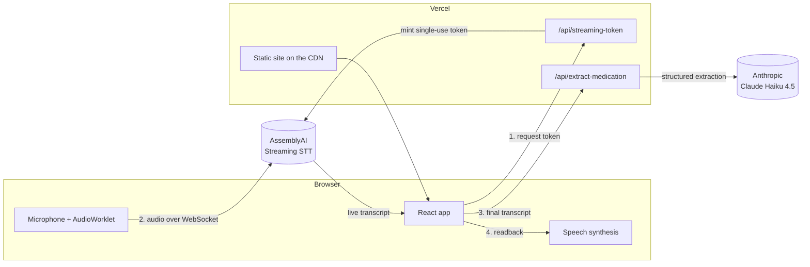

<p align="center">
  
</p>

<p align="center">
  <strong>Helping pharmacists and customers hear the same thing.</strong><br />
  A voice communication safety layer for the pharmacy counter.
</p>

<p align="center">
  <a href="https://medcle.vercel.app"><strong>Live demo</strong></a> ·
  <a href="https://medcle.vercel.app/app">Open the counter tool</a>
</p>

---

## The problem

Customers aren't pharmacists. Generic medication names are long, unfamiliar and easy to
mispronounce, so requests at the counter often come out half-said: *"I need the amoxic… amoxi… the
amoxy one? Five hundred, I think."* When the pharmacist hears one thing and the customer meant
another, a 500 mg request can become 50 mg.

## What MEDCLE does

MEDCLE listens to the customer, turns what they said into a clear request, and reads it back so
both people can confirm it before anything is handed over.

1. **The customer speaks naturally.** Speech is transcribed in real time. Recording stops by itself
   when the customer finishes.
2. **MEDCLE extracts the request.** The medication, strength, quantity and form that were
   explicitly stated are pulled out of the transcript. The transcript itself stays the record of
   what was said.
3. **MEDCLE reads it back.** *"I heard: amoxicillin, 500 milligrams. Is that correct?"* The
   customer confirms, asks to say it again, or replays it.
4. **Optional pharmacist read-back.** For a second check, the pharmacist repeats the request.
   MEDCLE compares the two field by field and flags any difference for both to confirm:
   *Strength: Customer 500 mg · Pharmacist 50 mg.*

## Safety principles

MEDCLE is a communication aid. The pharmacist makes every medical decision.

| MEDCLE does | MEDCLE does not |
| --- | --- |
| Capture and transcribe what the customer says | Prescribe or diagnose |
| Extract only the details that were explicitly stated | Recommend medication |
| Read the request back for confirmation | Decide which dose is correct |
| Optionally compare it with what the pharmacist heard | Correct or guess medication names |
| Flag differences for both people to confirm | Replace the pharmacist |

These principles are enforced in the implementation, not just stated:

- **Nothing is corrected after the fact.** The extraction prompt keeps names and amounts exactly as
  transcribed, and a live test checks that an unfamiliar name such as "ancetamophin" is preserved.
- **Recognition is helped, not rewritten.** A vocabulary of common, hard-to-say medication names is
  passed to the speech model as key terms, so a hesitant "amoxicillin" is more likely to be *heard*
  correctly. The result is still read back for confirmation.
- **The comparison is deterministic.** It uses no AI and no medical knowledge. It ignores only case
  and spacing, never picks a side, and reports a detail stated by one person only as unconfirmed,
  not as a mismatch.
- **No guessing.** If no medication name was heard, MEDCLE asks the customer to say it again.

## Architecture



- **Audio never passes through MEDCLE's servers.** The browser streams directly to AssemblyAI using
  a single-use token that must be redeemed within 60 seconds and caps the session at 10 minutes.
- **API keys stay server-side.** They live in environment variables that only the two serverless
  functions can read.
- **Stateless.** There is no database and no file storage. MEDCLE does not store recordings or
  transcripts.
- **Portable.** The same route logic runs as Vercel Functions in production and inside an Express
  server locally, so the app can also be self-hosted on any Node host.

## Tech stack

| Area | Technology |
| --- | --- |
| Frontend | React 19, TypeScript, Vite 8, plain CSS, Web Audio (AudioWorklet), Web Speech API |
| Speech-to-text | AssemblyAI Streaming v3 (`universal-3-6-pro`) with medication key terms and end-of-turn detection |
| Extraction | Anthropic Claude Haiku 4.5 with structured JSON output |
| Backend | Vercel Functions (Node.js 24); Express 5 for local development and self-hosting |
| Hosting | Vercel (CDN, serverless functions, environment variables, deploys from GitHub) |
| Quality | TypeScript (strict), ESLint, Node test runner, Vitest, Testing Library |

## Getting started

**Requirements:** Node.js 24, an [AssemblyAI API key](https://www.assemblyai.com/app/api-keys) and an
[Anthropic API key](https://platform.claude.com/settings/keys).

```sh
git clone https://github.com/sniperchief/MedCle.git
cd MedCle
npm install
cp .env.example .env   # then add your API keys
npm run dev            # http://localhost:3000
```

| Variable | Required | Description |
| --- | --- | --- |
| `ASSEMBLYAI_API_KEY` | Yes | AssemblyAI key for transcription. Server-side only. |
| `ANTHROPIC_API_KEY` | Yes | Anthropic key for medication extraction. Server-side only. |
| `PORT` | No | Port for the local server. Defaults to `3000`. |

Browsers only allow microphone access on `localhost` or over HTTPS.

## Scripts

| Command | Description |
| --- | --- |
| `npm run dev` | Local server with hot reload |
| `npm run build` | Type-check and build the client into `dist/` |
| `npm start` | Serve the production build and API with Express |
| `npm test` | Unit and component tests (no network access) |
| `npm run test:live` | Extraction tests against the real Claude API (billed; requires a key) |
| `npm run typecheck` | Type-check the client, server, functions and tests |
| `npm run lint` | Lint the project |

## Testing

`npm test` runs the whole suite offline, with no API keys needed:

- **Server and logic:** extraction output validation, request validation, the Vercel functions,
  the deterministic comparison, the spoken warning and readback text, and the medication key-term
  limits.
- **Components:** the readback, mismatch confirmation and voice warning (with a mocked
  `speechSynthesis`), the recording session's auto-stop behaviour (with a mocked AssemblyAI SDK),
  routing, the optional pharmacist read-back, and the navigation menu and footer.

`npm run test:live` runs a set of real transcripts through Claude to check that extraction keeps
names as spoken, returns `null` for details that weren't stated, and ignores small talk.

## Deployment

MEDCLE is deployed on [Vercel](https://vercel.com). The Vite build is served from the CDN, and the
two API routes run as Vercel Functions from `api/`. `vercel.json` configures the build and serves
the app at `/app`.

1. Import the repository in Vercel (**Add New → Project**). Build settings come from `vercel.json`,
   and Node.js 24 from `package.json`.
2. Add `ASSEMBLYAI_API_KEY` and `ANTHROPIC_API_KEY` under **Settings → Environment Variables** for
   Production and Preview, then redeploy.
3. Before sharing the URL, protect the paid APIs:
   - add a **Firewall rate-limit rule** for paths starting with `/api/`, for example 20 requests
     per minute per IP;
   - set spending limits in the AssemblyAI and Anthropic dashboards.

Pushes to `main` deploy automatically.

## Project structure

```
api/                          Vercel Functions (thin wrappers around server/ logic)
server/                       Route logic, Claude extraction, Express server, configuration
shared/                       Types shared by the client and the server
public/                       Logo, favicons and web app manifest
src/
  landing/                    Landing page sections
  transcription/              Microphone capture, AssemblyAI session, medication key terms
  extraction/                 Extraction requests and state, with retry
  comparison/                 Deterministic customer vs pharmacist comparison
  voice/                      Spoken readback and mismatch warning
  components/                 Speaker panels, readback, comparison, confirmation, layout
  router.tsx                  Client-side routing for "/" and "/app"
```

## Privacy

Speech is sent to AssemblyAI for transcription, and the finished transcript to Anthropic for
extraction, under those providers' data policies. MEDCLE itself does not store recordings or
transcripts. Anyone planning real pharmacy use should review the health-data rules that apply
where they operate, and tell customers that the conversation is transcribed.

## Limitations

- English only, tuned for a single speaker per recording.
- The medication key terms cover common names only; other names get no recognition help.
- One medication per request: if several are mentioned, the first is extracted.
- Voice output depends on the voices installed on each device.
